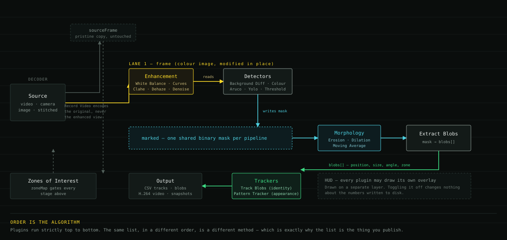

A pipeline is an ordered list of plugins. They run top to bottom on two shared
images: the **frame** (colour) and the **mask** (binary, marking which pixels are
currently of interest).



| Plugin group | Reads | Writes |
| --- | --- | --- |
| Enhancement | frame | frame, in place |
| Detectors (background subtraction, colour, threshold, markers, YOLO) | frame | mask |
| Morphology (erosion, dilation, moving average) | mask | mask |
| Extract Blobs | mask | the blob list |
| Trackers | blob list | identities, mask |
| Recording | frame or mask | files |

Detectors that find objects rather than pixels — YOLO, ArUco, Pattern Tracker —
draw their results into the mask as filled shapes. Extract Blobs and the trackers
therefore treat them like any other detection, so the front of a pipeline can be
swapped without changing the rest.

## Order matters

Plugins run in list order, so the same set of plugins in a different order is a
different analysis:

```
Background Diff Knn  →  Erosion  →  Extract Blobs     noise removed before measuring
Background Diff Knn  →  Extract Blobs  →  Erosion     noise measured as blobs
```

Nothing warns about the second, because it is a reasonable thing to want in other
situations.

## Active and Output

Two independent checkboxes on every plugin.

**Active** — whether it runs. Deactivating keeps the parameters, which is the
convenient way to test whether a stage is contributing anything.

**Output** — whether it writes its file. This does nothing on its own. A file is
written only when the plugin is active, Output is ticked, *and* output is armed
with **REC**. In [batch mode](/guide/batch/), arming is automatic.

Nothing is written while paused on a frame, so sitting on one frame with REC
armed does not append duplicate rows.

## Combining detectors

Most detectors have an **Additive** checkbox controlling how their result merges
with the existing mask:

- **off** — AND, keeping only pixels both agree on (*moving and the right colour*)
- **on** — OR, adding pixels to the mask (*moving or carrying a marker*)

Two independent cues intersected with Additive off is an effective noise filter.

## Enhancement is applied once per frame

Enhancement plugins modify the frame in place, so the effect is visible live and
every detector downstream benefits. The engine keeps an untouched copy of each
decoded frame and restores it before re-processing, so stepping back and forth
over a frame does not stack the effect.

That copy is also what [Record Video](/plugins/output/) writes — recordings are
always of the original footage, never the enhanced or annotated view.

## Threads

The frame is split into horizontal slices, one per CPU core, and per-pixel
plugins run on each slice in parallel. Plugins needing the whole image — blob
extraction, tracking, object detection, enhancement — run single-threaded.

Because each slice is processed independently, neighbourhood operations such as
erosion treat slice edges as image borders. The result therefore depends slightly
on the number of cores. Adding `<Threads>4</Threads>` to the settings file pins
it; see [known issues](/project/known-issues/).

## Some plugins delay the display

Temporal Denoise reads frames ahead of the current one, and Moving Average in
centered mode aligns its result with the displayed frame by showing a frame from
slightly behind the pipeline. Both mean playback runs a little behind the
decoder. Output timestamps refer to the displayed frame, so they are already
consistent.

Stepping backwards past the buffered range requires seeking to a keyframe and
decoding forward again, which is why a long jump back shows a progress
indicator.
