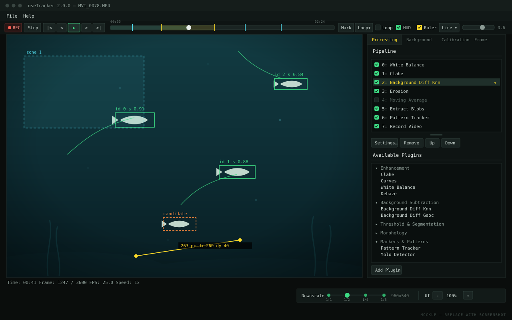
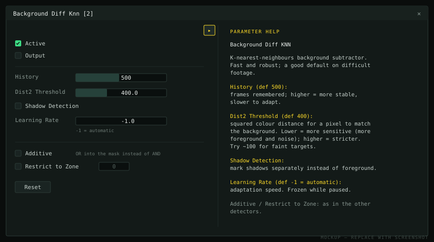

## Menu

| Item | |
| --- | --- |
| `File → Open Source…` | Video file, image, or USB camera. <kbd>Ctrl</kbd>+<kbd>O</kbd> |
| `File → Save Source…` | Save the source definition, including multi-camera stitching and calibration |
| `File → Load Settings…` | Load a pipeline and its parameters. <kbd>Ctrl</kbd>+<kbd>L</kbd> |
| `File → Save Settings…` | Save them. <kbd>Ctrl</kbd>+<kbd>S</kbd> |

Source and settings are separate files: the settings file describes the analysis
and is meant to be reused across recordings.

## Toolbar

| Control | |
| --- | --- |
| **REC** | Arms output. Nothing is written to disk until this is on. <kbd>Ctrl</kbd>+<kbd>R</kbd> |
| **Stop** | Back to the start; also closes output |
| `\|<` `>\|` | Playback speed, 1/16× to 16× |
| `<` `>` | Step one frame back or forward |
| `>` / `\|\|` | Play / pause (<kbd>Space</kbd>) |
| seek bar | Scrub. Bookmarks and the loop range are drawn on it |
| **Mark** | Bookmark at the current frame (or <kbd>Ctrl</kbd>+click the bar) |
| **Loop+** | Set loop start, then end (or <kbd>Shift</kbd>+click the bar) |
| **HUD** | Show or hide plugin overlays. Does not affect what is written |
| **Ruler** | Measure distances or boxes in source pixels |
| blend slider | Fade between the processed view and the original frame |

The blend slider is the most useful control for judging a mask: on its own a
white blob only tells you something was detected, not whether it covers the
animal.

## Video area

| | |
| --- | --- |
| Scroll wheel | Zoom, centred on the cursor |
| Middle-drag | Pan |
| Left-drag | Pan when zoomed in, if no tool is active |
| Double-click | Reset zoom |

Four tools take over the left button while active: the Ruler, seeding a Pattern
Tracker target, White Balance's pick-white, and zone polygon editing (active
whenever a Zones of Interest plugin is selected). While one is active, left-drag
panning and double-click reset are suspended.

Under the video, a status line shows time, frame number, the source frame rate
and the playback speed.

## Right panel

### Processing

The pipeline at the top, available plugins below.

- **Checkbox** — activate or deactivate a plugin without losing its settings
- **Click a row** — select it, and show the image *at that point in the pipeline*
- **Double-click** — open its settings dialog
- **Settings… / Remove / Up / Down** — act on the selected row

Selecting rows in turn is how you find which stage broke something. Every plugin
dialog has a **?** button that folds out help for its parameters.

### Background

Computes a static background image from the recording (mean or median over
sampled frames), or loads one. Also loads a zone-map image. See
[zones and background](/guide/zones-background/).

### Calibration

Lens-distortion calibration from a chessboard or circle grid. Relevant if you
measure distances or speeds with a wide-angle lens; not needed for counts or zone
occupancy.

Board width and height are the number of **inner corners**, not squares — the
usual reason detection never succeeds. With a multi-camera source, each device is
calibrated separately.

### Processing Frame

| | |
| --- | --- |
| **Start Time**, **Duration** | Restrict processing to a time window |
| **Use Time Boundaries** | Must be ticked for the above to take effect |
| **Timestep** | Process one frame every *n* seconds; 0 processes every frame |

These are saved in the settings file and apply to batch runs, unlike bookmarks
and the loop range, which are interface state only.

Timestep speeds up slow measurements such as occupancy, but it changes the
meaning of anything temporal: trackers see larger jumps between frames, and
background models see fewer frames. Tune at the timestep you intend to use.

## Bottom right

**Downscale** runs the whole pipeline on a smaller frame, with snap points at
1:1, 1/2, 1/4 and 1/8. Output coordinates are converted back to source
resolution, but pixel-valued parameters — blob size, erosion size, search
distance — act on the smaller image.

**UI** scales the interface and font from 50% to 400%.

## Keyboard shortcuts

| | |
| --- | --- |
| <kbd>Space</kbd> | Play / pause |
| <kbd>←</kbd> <kbd>→</kbd> | Step one frame |
| <kbd>+</kbd> <kbd>-</kbd> | Playback speed |
| <kbd>Backspace</kbd> | Stop, and close output |
| <kbd>Ctrl</kbd>+<kbd>O</kbd> / <kbd>L</kbd> / <kbd>S</kbd> / <kbd>R</kbd> | Open source / load settings / save settings / arm output |
| <kbd>Esc</kbd> | Quit, with confirmation |

These are only handled when a source is loaded — with an empty window, use the
menu.
