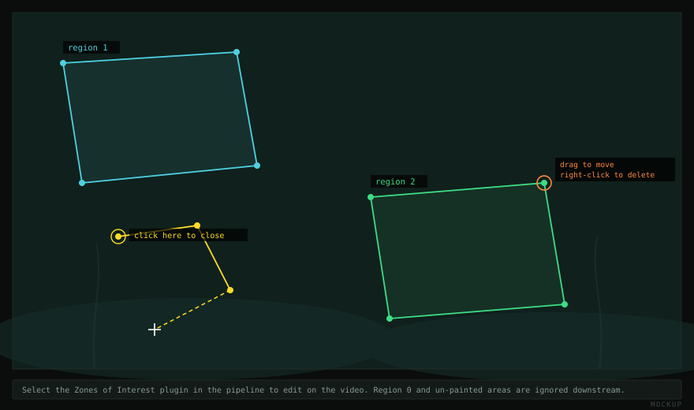

## Zones of interest

Zones restrict processing to part of the frame and label detections by region.
They are worth setting up early: they remove whole categories of false positive
(reflections on tank walls, the experimenter at the edge of frame), and excluded
pixels cost no processing time.



Region **0** and unpainted areas are ignored. Regions **1, 2, 3…** are yours to
define. Any detector's **Restrict to Zone** option keeps only one region.

### Drawing polygons

Add a **Zones of Interest** plugin and select it in the pipeline — the video
enters editing mode automatically.

| | |
| --- | --- |
| Left-click | Add a vertex |
| Left-click the first vertex, or right-click | Close the polygon |
| Drag a vertex | Move it |
| Right-click a vertex | Delete it |

New polygons default to region 1; the dialog changes the region of the selected
polygon. Select a different plugin to leave editing mode.

Polygons are stored in the settings file, so a configuration is self-contained.
They can also be saved to a separate text file for reuse across configurations.

Two practical notes: draw zones at 1:1 rather than downscaled, and leave a small
margin outside the arena wall — a boundary drawn exactly on the wall clips
animals that touch it, which biases their measured area and position inward.

### Zone images

Alternatively, load a grayscale image whose pixel values are region numbers, from
the Background tab or with `-m` on the command line. Useful when the regions come
from elsewhere — a drawing of the apparatus, a mask exported from ImageJ. The
plugin can load an image and draw polygons on top of it.

### Using the labels

Blobs and tracked entities carry a `zone` column, so occupancy is a grouping
operation rather than geometry solved afterwards:

```python
occ = (df.groupby(["entity", "zone"]).size()
         .groupby(level=0).apply(lambda s: s / s.sum()))
```

## Background

The [Background Difference](/plugins/background/) plugin subtracts a fixed image
of the empty scene. It is the most predictable detector — no adaptation, no
warm-up, and a motionless animal is never absorbed — but it assumes the scene
does not change.

### Making one

On the **Background** tab:

| | |
| --- | --- |
| **Method** | `Mean` or `Median`. Median is markedly better when animals pause. |
| **Frames** | How many frames to sample. 25–50 is better than the default 11 for median. |
| **Start / End Time** | Sample across a long span — consecutive frames have the animals in nearly the same place, so the median cannot remove them. |
| **Low / High Threshold** | Exclude pixel values outside these bounds from the calculation. |
| **Calculate Background** | Build it |
| **Save / Load Background** | Write it to PNG, or load one |

A real photograph of the empty arena, recorded before the animals go in, is
better than any estimate and unambiguous to describe. If that is possible, do
that.

To check it, add a Background Difference plugin, select it, and look at the mask
on a frame where the animals are somewhere they were not during sampling.
Persistent white patches where nothing moves mean the background still contains a
ghost.

### When to use an adaptive model instead

If the lighting drifts, the water surface moves, plants sway, or the recording
runs for hours, a static image goes stale. Use KNN or GSOC, which relearn the
background continuously and need no image. The trade is that an animal which
stops moving for long enough is gradually absorbed into the background.

See [background subtraction](/plugins/background/).

## Lens calibration

Separate from both of the above, on the Calibration tab. Correcting lens
distortion matters if you measure distances, speeds or areas with a wide-angle
lens, and not at all for counts or occupancy. Calibration is saved with the
*source*, not the pipeline, so one calibration file can be reused across every
recording from that camera (`--calibration` on the command line).
